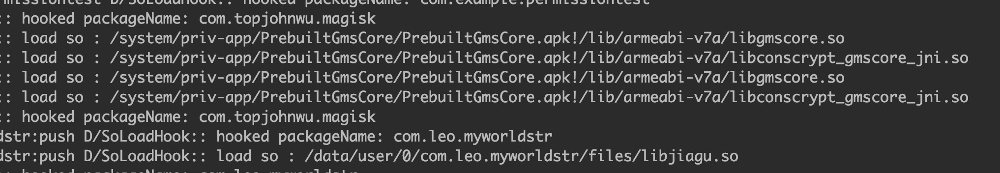
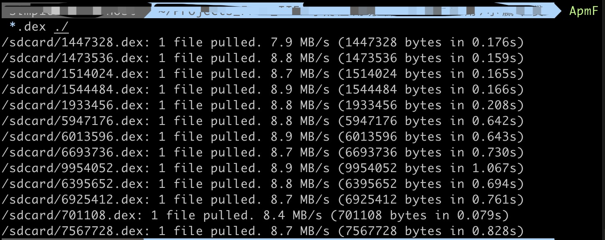

# tools-about-mobile
## Introduction
The repo is used to update some tools about mobile writen by me.Just tested in Nexus 5,the system version is android 6.0.1_r77.
## Context
### PermissionAutoAllow.apk
a Xposed module to auto-allow all runtime permissions.
### SoLoadedHook.apk
a Xposed module to help analyser get `so` file which is loaded by the selected app.The code refers to [forree's repo](https://github.com/fooree/fooXposed/tree/master/Foox_1stx).Thanks for him/her.

### adb_pull_mutiple_files.sh
a shell script to pull mutiple files from mobile using adb.
#### The Usage
`./adb_pull_mutiple_files.sh {pattern_file} {target_folder}`

## Written in the end
Do not use these tools maliciously, or you will be responsible for all consequences.
